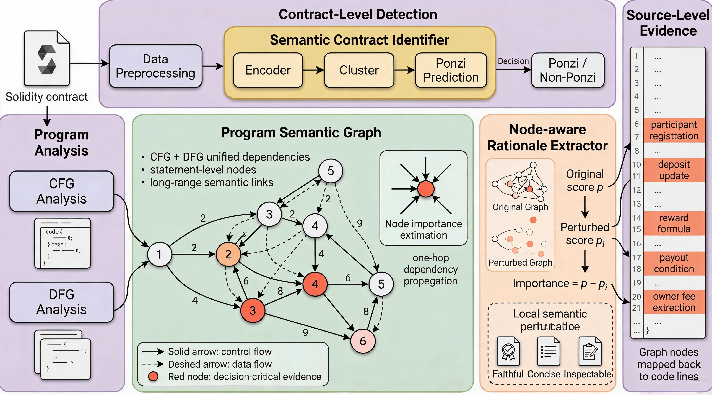

# PonziSense

PonziSense is an explainable framework for detecting Ponzi smart contracts and returning source-grounded risk evidence. This repository is a lightweight reproduction package: it keeps the core implementation needed to reproduce the paper pipeline, while excluding private datasets, checkpoints, virtual environments, generated outputs, and internal temporary files.



## What This Repository Contains

PonziSense follows the paper workflow shown above:

1. Solidity contracts are preprocessed into statement-level units.
2. Control-flow and data-flow information are extracted to build a program semantic graph.
3. The semantic contract identifier encodes contract behavior and predicts `Ponzi` or `Non-Ponzi`.
4. The node-aware rationale extractor perturbs graph evidence and ranks decision-critical statements.
5. Important graph nodes are mapped back to source-code lines for auditor-facing explanations.

The package is intentionally code-centered. It does not include the full raw Solidity dataset, trained checkpoints, server virtual environments, generated experiment outputs, or internal binary/parser build artifacts.

## Repository Layout

| Path | Purpose |
| --- | --- |
| `train.py` | Main model training entry point. |
| `evaluate.py` | Evaluation entry point for trained checkpoints. |
| `predict.py`, `inference.py` | Contract-level prediction and explanation utilities. |
| `preprocess_dataset.py` | Dataset preprocessing and train/validation/test split generation. |
| `configs/` | Reproduction constants, paths, labels, and model options. |
| `data/` | Dataset loading, feature extraction, graph building, tokenization, and batching. |
| `graph/` | Program semantic graph construction and edge/rationale helpers. |
| `models/` | Encoder, graph propagation, classifier, and explanation modules. |
| `parser/` | Solidity parsing and data-flow helpers used by the preprocessing pipeline. |
| `utils/` | Losses, metrics, perturbation utilities, rationale mapping, and reproducibility helpers. |
| `scripts/` | Dataset construction and ICSE experiment orchestration scripts. |
| `experiments/common/` | Shared experiment loaders, inference wrappers, plotting, and output helpers. |
| `experiments/icse/` | Paper-oriented reproduction scripts for audit, ablation, robustness, faithfulness, and efficiency. |
| `experiments/case_study/` | Case-study rendering and latency utilities. |
| `baseline/` | Lightweight classical baseline code. |
| `system/` | Optional Flask web system for interactive analysis and bilingual demonstration. |
| `demo/` | Address-level demo metadata; Solidity source code is not included. |
| `figure/overall.png` | Project overview figure used by this README. |
| `datafiles/` | Placeholder for user-restored datasets. |
| `outputs/` | Placeholder for checkpoints, logs, tables, and generated experiment outputs. |

## Environment Setup

The recommended setup is a Python virtual environment with PyTorch, Transformers, PyTorch Geometric, Tree-sitter, Flask, and the scientific Python stack.

```bash
cd PonziSense_repro
bash setup_environment.sh
source .venv_linux/bin/activate
```

On an A100/CUDA server, load the server CUDA compatibility script before training when available:

```bash
source /etc/profile.d/a100_cuda.sh
```

If PyTorch is already installed at the system level, reuse it instead of reinstalling:

```bash
INSTALL_TORCH=0 bash setup_environment.sh
```

For a quick dependency check:

```bash
bash setup_environment.sh --check-only
```

## Dataset Preparation

The full paper dataset is not included in this lightweight release. The expected training format is a CSV file with at least:

```text
code,label,explain
```

where `code` is Solidity source code, `label` is `1` for Ponzi and `0` for non-Ponzi, and `explain` stores source-level rationale annotations or evidence text when available.

For public artifact release, the dataset should be distributed in a slim address-level format such as:

```text
address,label,explain,split,source,hash
```

This keeps the repository small and avoids redistributing large raw source-code fields. Users can restore the `code` column from verified public sources such as Etherscan, Sourcify, or an institutional archive, then run preprocessing:

```bash
python preprocess_dataset.py
```

The processed files are expected under:

```text
datafiles/processed/train.csv
datafiles/processed/val.csv
datafiles/processed/test.csv
```

To construct the paper-style Ponzi-E dataset from local positive contracts and supplemented non-Ponzi contracts, use:

```bash
python scripts/build_ponzi_e_dataset.py
python scripts/preprocess_ponzi_e_constructed.py \
  --input datafiles/ponzi_e_constructed/ponzi_e_real_contracts.csv \
  --output-dir datafiles/processed_ponzi_e
```

## Training

Single-GPU training:

```bash
python train.py
```

Dual-GPU distributed training:

```bash
CUDA_VISIBLE_DEVICES=0,1 torchrun --standalone --nproc_per_node=2 train.py
```

The default code writes checkpoints and logs under `outputs/`. The expected best checkpoint path is:

```text
outputs/checkpoints/best_model.pt
```

## Evaluation and ICSE Experiments

Evaluate a trained model:

```bash
python evaluate.py
```

Run the ICSE reproduction suite after preparing data and a checkpoint:

```bash
TEST_PATH=datafiles/processed_ponzi_e/test.csv \
CHECKPOINT=outputs/checkpoints/best_model.pt \
OUTPUT_DIR=outputs \
bash scripts/run_icse_experiments.sh
```

The ICSE scripts cover:

| Script | Purpose |
| --- | --- |
| `run_dataset_audit.py` | Dataset size, label, duplication, and split diagnostics. |
| `run_dataset_stress_eval.py` | Dataset stress evaluation and shift checks. |
| `run_graph_component_ablation.py` | CFG/DFG/semantic-edge component ablation. |
| `run_mechanism_role_coverage.py` | Mechanism-role coverage for source-level rationales. |
| `run_syntax_preserving_faithfulness.py` | Faithfulness under syntax-preserving perturbations. |
| `run_refactor_robustness.py` | Transformation sensitivity checks. |
| `run_efficiency_benchmark.py` | Runtime and throughput measurements. |
| `collect_icse_results.py` | Aggregates JSON outputs into a single result bundle. |

## Interactive System

The optional web system provides a lightweight interface for contract analysis, explanation display, source-line mapping, and bilingual English/Chinese UI.

```bash
python -m system
```

or:

```bash
./run_web.sh
```

Useful environment variables:

| Variable | Meaning |
| --- | --- |
| `PONZI_HOST` | Flask host, default `0.0.0.0`. |
| `PONZI_PORT` | Flask port, default `7860`. |
| `PONZI_CKPT` | Override checkpoint path. |
| `PONZI_DEFAULT_LANGUAGE` | UI language, `en` or `zh`. |
| `PONZI_EXPLAIN_TOP_K` | Number of explanation items to display. |

## Reproducibility Notes

This package keeps the implementation required to reproduce the paper logic, but several artifacts must be restored by the user:

1. Raw Solidity source code or a restored source-code CSV.
2. Trained model checkpoints.
3. Generated experiment outputs and logs.
4. Server-specific CUDA/runtime configuration.

The following items were intentionally excluded from this cleaned package:

1. Virtual environments: `.venv`, `.venv_linux`.
2. Caches and compiled Python files: `.cache`, `__pycache__`.
3. Full raw datasets and processed full-source CSV files.
4. Model checkpoints and generated output tables.
5. Temporary patches, backup files, and internal paper LaTeX folders.
6. Binary parser artifacts such as `my-languages.so`.

## Minimal Reproduction Flow

```bash
cd PonziSense_repro
bash setup_environment.sh
source .venv_linux/bin/activate

# Restore or prepare data first.
python preprocess_dataset.py

# Train and evaluate.
python train.py
python evaluate.py

# Run paper-oriented experiments.
TEST_PATH=datafiles/processed/test.csv \
CHECKPOINT=outputs/checkpoints/best_model.pt \
OUTPUT_DIR=outputs \
bash scripts/run_icse_experiments.sh
```

## Citation

If you use this artifact, cite the PonziSense paper and describe the exact dataset restoration procedure used for the released address-level dataset.
