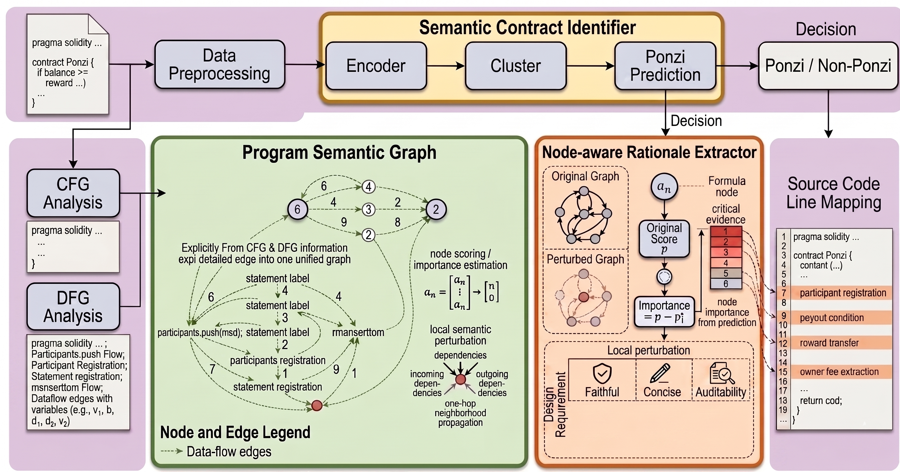

# PonziSense

**PonziSense** is an explainable detector for Ponzi smart contracts. It follows the paper pipeline: contract-level Ponzi prediction plus source-level rationale extraction, so each positive decision can be traced back to suspicious Solidity statements such as participant registration, payout conditions, reward transfer, and owner-fee extraction.



## What This Repository Contains

This open-source package contains only the engineering code needed to reproduce the paper method.

Included:

- Core pipeline: `preprocess_dataset.py`, `train.py`, `evaluate.py`, `predict.py`, `inference.py`
- Model implementation: `models/`, `data/`, `graph/`, `utils/`, `configs/`
- Program semantic graph and rationale utilities: `graph/`, `utils/rationale_extractor.py`, `utils/explain_metrics.py`
- Baselines and paper experiment runners: `baseline/`, `experiments/`, `hpo/`
- Solidity parser source and build script: `parser/tree-sitter-solidity/`, `parser/build.py`
- Compact source-free dataset index: `datafiles/ponzi_e_release.csv`

Intentionally excluded:

- Raw Solidity source-code datasets
- Generated `datafiles/processed/` train/validation/test splits
- Checkpoints, `.bin`, `.pt`, `.pth`, `.ckpt`, `.safetensors`, generated parser binaries, logs, and experiment outputs
- Internal Web/demo/system software
- Paper LaTeX sources, build artifacts, caches, virtual environments, and notebooks

## Method Overview

PonziSense has three main components.

1. **Semantic Contract Identifier** encodes Solidity source code, learns semantic representations, clusters related behaviors, and predicts `Ponzi` or `Non-Ponzi`.
2. **Program Semantic Graph Constructor** converts source code into a statement-level semantic graph using control-flow, data-flow, and local dependency information.
3. **Node-aware Rationale Extractor** estimates statement importance through local perturbation and maps high-impact graph nodes back to source-code lines.

The final output is both a contract-level prediction and a sparse explanation over source statements.

## Environment Setup

Recommended environment:

- Python 3.10 or 3.11
- CUDA-capable GPU for full training
- Linux/macOS shell environment
- `gcc`/build tools for tree-sitter parser compilation

Create an environment and install dependencies:

```bash
conda create -n ponzisense python=3.10 -y
conda activate ponzisense
pip install -r requirements.txt
```

Build the Solidity parser binary locally:

```bash
cd parser
python build.py
cd ..
```

The build step creates `parser/my-languages.so`. This generated binary is intentionally not committed.

Optional baseline dependencies:

```bash
pip install -r baseline/requirements.txt
pip install -r experiments/requirements-optional.txt
```

## Dataset

The released dataset is:

```text
datafiles/ponzi_e_release.csv
```

It contains `8,233` contracts:

| Split | Non-Ponzi (`0`) | Ponzi (`1`) | Total |
| --- | ---: | ---: | ---: |
| train | 4,493 | 446 | 4,939 |
| val | 1,498 | 149 | 1,647 |
| test | 1,498 | 149 | 1,647 |
| total | 7,489 | 744 | 8,233 |

Columns:

| Column | Description |
| --- | --- |
| `contract_id` | Stable row identifier in the released benchmark index |
| `address` | Ethereum contract address |
| `code_hash` | Irreversible hash of the original source snapshot, used for audit and deduplication |
| `label` | `1` for Ponzi, `0` for non-Ponzi |
| `explain` | Source-level rationale text for positive examples when available in the benchmark construction |
| `split` | Paper-style `train`, `val`, or `test` split |
| `source` | Provenance of the row in the construction pipeline |
| `explain_source` | Provenance of the explanation field |

### Why Source Code Is Removed

GitHub is not a good place to publish the full raw Solidity source snapshot because it is large, redundant, and may include third-party source files with mixed licensing or provenance. To keep the repository lightweight and safer to redistribute, the public CSV removes the `code` column and keeps contract addresses instead.

This does not change the label convention or split assignment. It only means the release CSV is a compact benchmark index, not a directly trainable source-code table.

### How To Restore A Trainable Dataset

To train PonziSense, `preprocess_dataset.py` expects a CSV with exactly these columns:

```text
code,label,explain
```

You can recover source code for address-backed contracts from public verification services:

```bash
python scripts/materialize_dataset_from_addresses.py \
  --input datafiles/ponzi_e_release.csv \
  --output datafiles/PonziDataset_20221114_explain_augmented_negatives.csv
```

The script tries Sourcify first. If you also want Etherscan fallback, set an API key:

```bash
export ETHERSCAN_API_KEY=your_key_here
python scripts/materialize_dataset_from_addresses.py \
  --input datafiles/ponzi_e_release.csv \
  --output datafiles/PonziDataset_20221114_explain_augmented_negatives.csv
```

After materialization, run preprocessing:

```bash
python preprocess_dataset.py
```

This creates:

```text
datafiles/processed/train.csv
datafiles/processed/val.csv
datafiles/processed/test.csv
datafiles/processed/report.json
```

If you already have a private full dataset, place it at:

```text
datafiles/PonziDataset_20221114_explain_augmented_negatives.csv
```

and make sure it has `code,label,explain` columns.

## Quick Start

Run the full local pipeline after source-code materialization:

```bash
python preprocess_dataset.py
python sanity_check.py
python train.py
python evaluate.py
```

Run prediction/inference examples:

```bash
python predict.py
python inference.py
```

## Training Shortcuts

One-command training flow:

```bash
python scripts/materialize_dataset_from_addresses.py \
  --input datafiles/ponzi_e_release.csv \
  --output datafiles/PonziDataset_20221114_explain_augmented_negatives.csv && \
python preprocess_dataset.py && \
python train.py && \
python evaluate.py
```

Use a specific GPU:

```bash
CUDA_VISIBLE_DEVICES=0 python train.py
```

Run paper experiment helpers:

```bash
bash experiments/run_all_experiments.sh
```


## Configuration

Main settings live in `configs/config.py`.

Important defaults:

- `POSITIVE_LABEL = 1`
- `PONZI_E_TOTAL_CONTRACTS = 8233`
- `PONZI_E_POSITIVE_CONTRACTS = 744`
- `PONZI_E_NEGATIVE_CONTRACTS = 7489`
- `TRAIN_RATIO = 0.60`, `VAL_RATIO = 0.20`, `TEST_RATIO = 0.20`
- `MODEL_NAME = microsoft/graphcodebert-base`
- `USE_GRAPH_BRANCH = True`
- `EXPLAIN_EVAL_USE_PERTURBATION = True`

For smaller GPUs, reduce these before training:

```python
TRAIN_BATCH_SIZE = 1
EVAL_BATCH_SIZE = 2
CODE_LENGTH = 256
DATA_FLOW_LENGTH = 64
GRAPH_MAX_STATEMENTS = 16
```

## Evaluation

Main evaluation:

```bash
python evaluate.py
```

The project reports contract-level classification metrics and source-level explanation metrics. The paper-style explanation evaluation is implemented in `utils/explain_metrics.py` and `utils/rationale_extractor.py`.

Experiment scripts are grouped by research question:

```text
experiments/rq1/    main detection metrics
experiments/rq2/    explanation faithfulness and overlap
experiments/rq3/    ablation plotting
experiments/rq4/    threshold and robustness studies
experiments/rq5/    embedding visualization
```

## Repository Layout

```text
PonziSense/
├── configs/                  # Paper-aligned configuration
├── data/                     # Dataset, parser, collation, augmentation
├── datafiles/                # Source-free release dataset index
├── experiments/              # RQ-oriented experiment scripts
├── graph/                    # Program semantic graph construction
├── hpo/                      # Hyperparameter search helpers
├── models/                   # PonziSense model components
├── parser/                   # Solidity tree-sitter parser source and build script
├── scripts/                  # Dataset construction/materialization utilities
├── utils/                    # Metrics, losses, rationale extraction, IO helpers
├── preprocess_dataset.py
├── train.py
├── evaluate.py
├── predict.py
└── inference.py
```

## Notes

The compact dataset is designed for open-source distribution. Exact reproduction of a private full-source snapshot requires materializing source code by address or using an already available full `code,label,explain` CSV.

PonziSense follows the paper convention throughout the released code: `label=1` means Ponzi and `label=0` means non-Ponzi.
